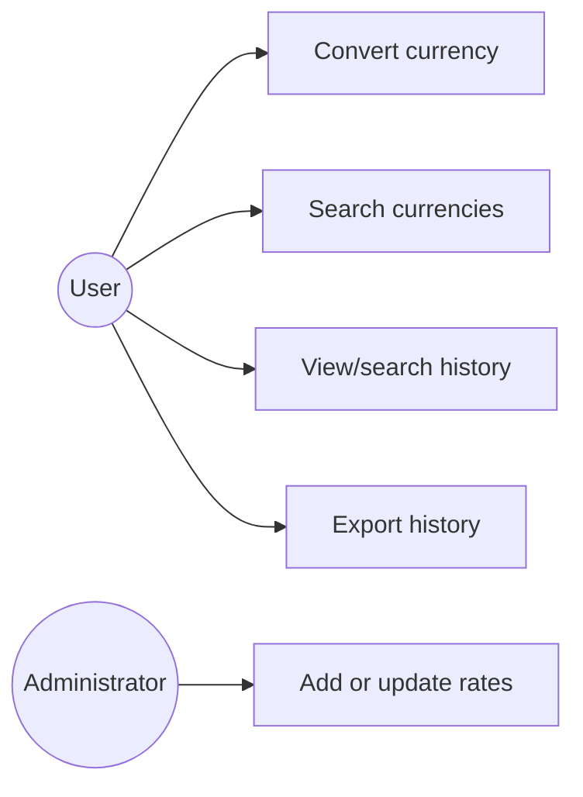
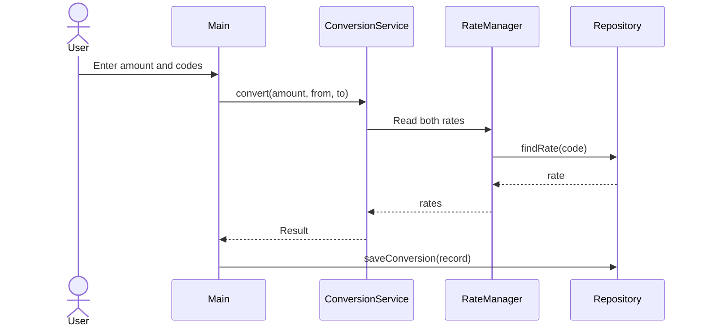

# ConCur: Offline Currency Converter and Exchange-Rate Management System

## Problem statement

People often need to calculate equivalent amounts in different currencies. Many converters require internet access. ConCur provides a simple offline converter in which exchange rates can be imported and maintained locally.

## Scope

The application maintains a currency catalogue, performs conversions, manages locally stored exchange rates, saves conversion history, exports records, and monitors the local rate table in a background thread. It does not retrieve live rates or perform financial transactions.

## Target users

- Students learning Java
- Users who need demonstrations with locally supplied rates
- Administrators who maintain the offline rate table

## Objectives and high-level features

- Search currencies by code or name
- Convert amounts using local rates
- Perform exchange-rate CRUD operations
- Save and search conversion history with JDBC
- Import and export CSV data
- Demonstrate background rate monitoring

## Functional requirements

1. The system shall list and search currencies known to Java.
2. The system shall convert a positive amount when both exchange rates exist.
3. The system shall allow exchange rates to be added or updated.
4. The system shall store successful conversions.
5. The system shall display and search conversion history.
6. The system shall export history to a CSV file.
7. The system shall periodically check the configured rate table in a background thread.

## Non-functional requirements

- **Usability:** Numbered console menu and clear messages.
- **Reliability:** Invalid input must not terminate the application unexpectedly.
- **Accuracy:** `BigDecimal` is used for monetary calculations.
- **Maintainability:** Models, services, and storage code have separate responsibilities.
- **Portability:** The project targets Java 8 or newer.

## Architecture

```text
Main (console)
  -> services (catalogue, rates, conversion)
  -> ConversionRepository interface
       -> JdbcConversionRepository (H2/JDBC)
       -> FileConversionRepository (offline fallback)
```

`Main` handles interaction. Services contain business rules. Repository classes contain persistence code. `RateMonitorTask` demonstrates multithreading, and `RateManager` synchronizes rate access.

## Database design

The H2 database contains two tables:

- `exchange_rates(currency_code, units_per_usd, updated_at)`
- `conversion_history(id, source_amount, source_currency, target_amount, target_currency, applied_rate, converted_at)`

If H2 is unavailable, the same information is stored in local CSV files through `FileConversionRepository`.

## Diagrams





## Testing

Run automated tests with:

```powershell
mvn clean test
```

Manual test: convert `1000 INR` to `USD`, view history, search by `INR`, export the CSV, search for `Indian Rupee`, update a rate, and exit with option `8`.

Expected validation behavior:

- Zero and negative amounts are rejected.
- Unknown currency codes are rejected.
- Missing exchange rates produce a helpful error.
- Invalid menu choices return to the menu.

